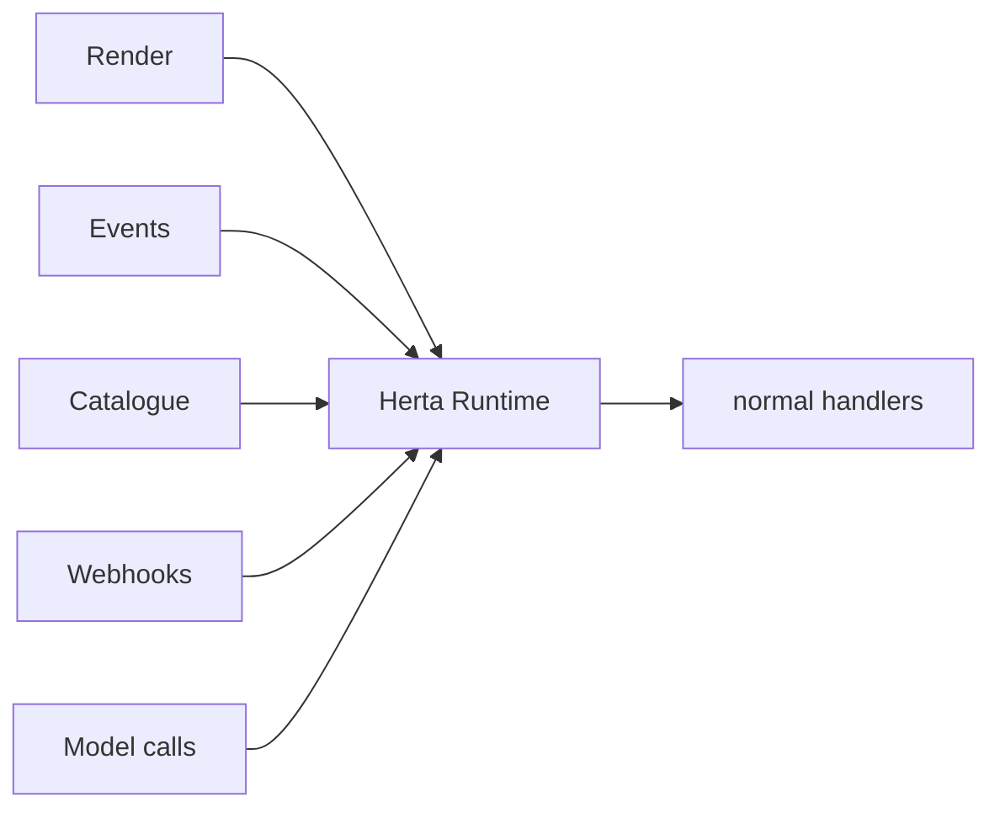
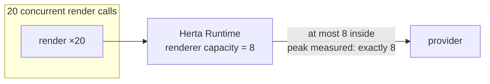
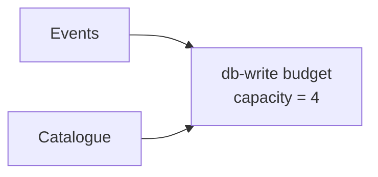
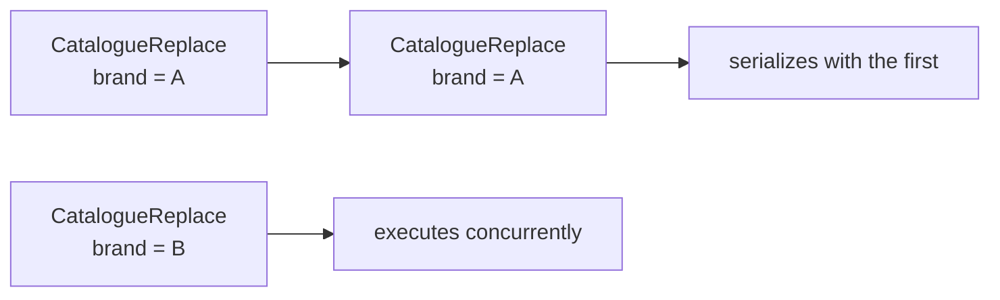
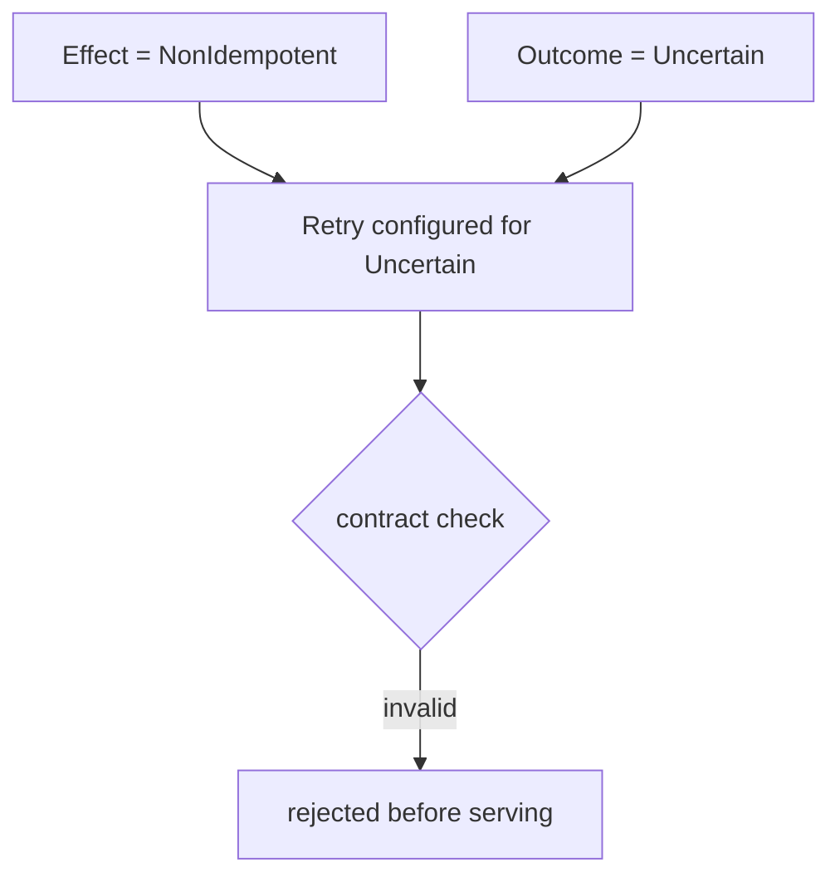
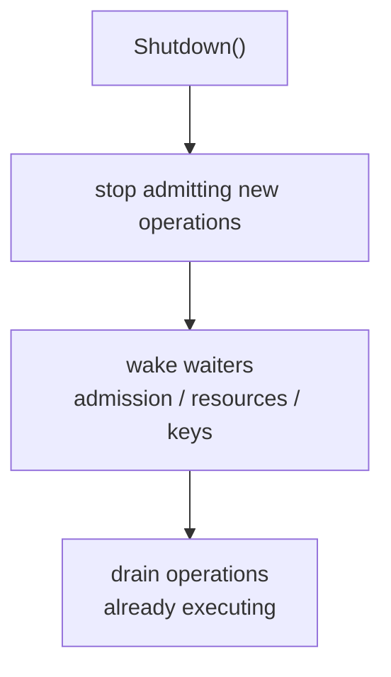

<div align="center">

<p align="center">
  
</p>

<p align="center">
  
  
</p>

**One execution model. Many heterogeneous operations.**

HertaSDK is an in-process execution contract runtime for Go. Operations stay
ordinary Go functions and declare what they consume, what side effects they
produce, and what failure means — the runtime validates those contracts and
arbitrates shared local capacity across otherwise-independent subsystems.


</div>

> **Status.** The execution model is implemented and proven internally. The
> public Go package is being extracted and is intentionally **not published
> yet** — there is no installable module, no API stability promise, and no
> public alpha until real-world consumer validation and extraction complete.
> See [ROADMAP.md](ROADMAP.md).

---

## Contents

- [What is HertaSDK?](#what-is-hertasdk)
- [Why?](#why)
- [Core model](#core-model)
- [Resource arbitration](#resource-arbitration)
- [Keyed serialization](#keyed-serialization)
- [Failure semantics](#failure-semantics)
- [Lifecycle](#lifecycle)
- [What Herta is NOT](#what-herta-is-not)
- [Conceptual API](#conceptual-api)
- [Current validation](#current-validation)
- [Roadmap](#roadmap)
- [Design principles](#design-principles)
- [Name / inspiration](#name--inspiration)
- [Docs](#docs)
- [Contributing / Security](#contributing--security)
- [License](#license)

---

## What is HertaSDK?

HertaSDK is a **local, in-process runtime** that owns execution policy — not
business logic. An operation is a typed wrapper around a normal handler; the
operation declares its execution contract and Herta enforces it:

<p align="center">
  
  
</p>

- **Operations remain normal Go functions.** Herta wraps them; it never owns
  what they compute, store, or return.
- **Herta owns execution policy.** Admission, shared resource budgets, keyed
  serialization, timeouts, retry safety, and shutdown belong to the runtime.
- **Contracts are declared up front.** Resources consumed, side-effect class,
  contention behavior, and failure meaning are part of construction — invalid
  combinations are rejected before serving, not discovered at 3am.
- **Arbitration is shared.** Independent subsystems (render, events, catalogue,
  webhooks, model calls) draw from the same named local budgets instead of
  each inventing its own semaphore, pool, and retry loop.

Start with [docs/concepts.md](docs/concepts.md) and
[docs/execution-model.md](docs/execution-model.md).

## Why?

Without a shared model, every subsystem invents slightly different execution
plumbing:

| Subsystem | Reinvented plumbing |
|---|---|
| Render | own semaphore / retry logic |
| DB writer | own pool / ordering logic |
| Webhook | own retry logic |
| Catalogue | own per-key locking |
| Model call | own quota handling |

Each one is subtly different, subtly wrong in a different way, and impossible
to reason about as a whole.

With Herta, shared policy and shared resources stay explicit:



Herta does **not** replace application-level business logic. It replaces the
five slightly-different semaphores, the four slightly-different retry loops,
and the three slightly-different shutdown paths with one contract the whole
process obeys.

Like nodes on a CAN bus, each worker runs asynchronously at its own pace —
different speeds, different shapes — but all obey the same arbitration and
error semantics:

<p align="center">
  
  
</p>

## Core model

| Primitive | Meaning |
|---|---|
| `Runtime` | Execution authority and lifecycle owner. Owns budgets, admission, shutdown. |
| `Operation[I, O]` | Typed wrapper around a normal handler. Carries a `Policy`. |
| `Resource` | A named finite local capacity (e.g. `renderer`, `db-write`). Weighted. |
| `Policy` | Resources, admission (`Wait`/`Reject`), timeout, retry, optional `SerializeBy(key)`. |
| `Effect` | Side-effect class: `Pure`, `Idempotent`, `NonIdempotent`. |
| `Outcome` | Failure meaning: `Success`, `Transient`, `Permanent`, `Throttled`, `Uncertain`. |

Effect says **whether repeating is safe**. Outcome says **what happened**.
Retry decisions require both — see [Failure semantics](#failure-semantics)
and [docs/failure-semantics.md](docs/failure-semantics.md).

## Resource arbitration

This is the defining feature — and it is more than "Herta has a semaphore."

Different operations may consume the **same** resource. A renderer budget of 8
is shared by every render call regardless of caller; a `db-write` budget is
shared by events and catalogue writes alike.

<p align="center">
  
  
</p>

Concrete behavior, measured in the internal reference implementation
(`renderer` capacity = 8, 20 concurrent render calls, measured peak inside
the provider: **exactly 8**):



And across subsystems sharing one budget:



Herta V0 arbitrates **per process**. It does not coordinate resources globally
across processes — see [docs/resource-arbitration.md](docs/resource-arbitration.md).

## Keyed serialization

Some operations must serialize per key while staying concurrent across keys:



`SerializeBy(key)` gives same-key serial / different-key concurrent execution.
Same-key waiters hold **zero downstream resource capacity** while waiting —
waiting work must not hoard scarce resources.

## Failure semantics

Retry decisions depend on **both** what happened and whether repeating is safe.
The important case is a contract the runtime rejects at construction:



Why: the external operation may already have executed, consumed quota, charged
money, or changed state. Retrying it speculatively is not a transport decision
— it is a business-safety decision, and the contract says it is unsafe.

Rules:

- Unclassified Go errors are treated **conservatively**: they do not trigger
  speculative retries.
- Unsafe retry combinations (e.g. retrying `Uncertain` on a `NonIdempotent`
  operation) fail construction-time validation.
- Caller cancellation is honored; per-attempt timeouts are cooperative
  contexts, not goroutine termination.

Full treatment in [docs/failure-semantics.md](docs/failure-semantics.md).

## Lifecycle



- Timeouts are cooperative `context.Context` deadlines.
- Panics release runtime-owned resources, then re-panic — cleanup without
  swallowing the failure.
- Stats are atomic; lifecycle behavior is race-clean under the Go race
  detector.

## What Herta is NOT

> Herta is **not** a queue, durable scheduler, transport, sidecar, broker,
> workflow engine, distributed semaphore, or actor framework.

It is an in-process execution contract. There is no network, no daemon, no
durable state, no cross-process coordination. If you need those, Herta is the
wrong tool — deliberately.

## Conceptual API

> **Conceptual API — the public Go API is still being extracted and may
> change.** This does not compile against any released package, because no
> package is released.

```go
// Illustrative only. Names, signatures, and package layout are not final.
runtime := herta.NewRuntime(herta.RuntimeConfig{ /* budgets, ... */ })

render := herta.NewOperation(herta.Policy{
    Resources: []herta.ResourceClaim{{ Name: "renderer", Weight: 1 }},
    Admission: herta.Wait,
    Effect:    herta.Idempotent,
    // ...
}, renderHandler)

result, err := render.Do(ctx, request)
```

What this sketch is meant to convey: the handler is ordinary; the policy is
explicit; the runtime does the arbitrating. Nothing more.

## Current validation

Internal V0 (reference implementation, **not in this repository**):

- 22 proof tests, ~94% statement coverage
- Go race detector clean
- 20 concurrent calls against capacity 8 → observed peak **exactly 8**
- Shared DB budget across heterogeneous operations
- Keyed serialization (same-key serial, different-key concurrent)
- Shutdown/admission race hammer
- Partial-acquire rollback
- Panic cleanup
- Unsafe retry combinations rejected at construction

> These results are from the internal reference implementation; the public
> repository does not contain the implementation yet.

## Roadmap

- [x] Execution model designed
- [x] Internal Go V0 implemented
- [x] Concurrency/lifecycle proof suite
- [x] Race-clean reference implementation
- [ ] Validate against real Mirai Render workload
- [ ] Validate Events and Catalogue workloads
- [ ] External heterogeneous validation workload
- [ ] Extract stable public Go package
- [ ] Publish Go alpha
- [ ] Benchmarks against conventional composition
- [ ] Evaluate Rust/Tower prototype
- [ ] Consider language-neutral execution contract specification

No dates are promised. Details in [ROADMAP.md](ROADMAP.md).

## Design principles

1. Business logic stays ordinary.
2. Shared constraints are explicit.
3. Retry safety is semantic, not guessed.
4. Waiting work should not hoard scarce resources.
5. Shutdown behavior is part of the execution contract.
6. Herta remains local until evidence proves a distributed layer is necessary.

## Name / inspiration

HertaSDK is named after Herta from Honkai: Star Rail — "many heterogeneous
clones sharing one environment" inspired the metaphor — and CAN-style resource
coordination influenced the architecture. Neither implies technical
compatibility or affiliation.

> **Disclaimer.** HertaSDK is an independent open-source project and is not
> affiliated with or endorsed by HoYoverse.

## Docs

- [docs/concepts.md](docs/concepts.md) — Runtime, Operation, Resource, Policy, Effect, Outcome
- [docs/execution-model.md](docs/execution-model.md) — lifecycle, admission, ordering, rollback, timeout, shutdown
- [docs/failure-semantics.md](docs/failure-semantics.md) — classification, retry safety, Uncertain, cancellation
- [docs/resource-arbitration.md](docs/resource-arbitration.md) — shared budgets, weighting, per-process scope
- [docs/architecture.md](docs/architecture.md) — runtime boundary, integration shape, what Herta is not

## Contributing / Security

- [CONTRIBUTING.md](CONTRIBUTING.md)
- [CODE_OF_CONDUCT.md](CODE_OF_CONDUCT.md)
- [SECURITY.md](SECURITY.md)

## License

[Apache-2.0](LICENSE) — see [LICENSE](LICENSE).
