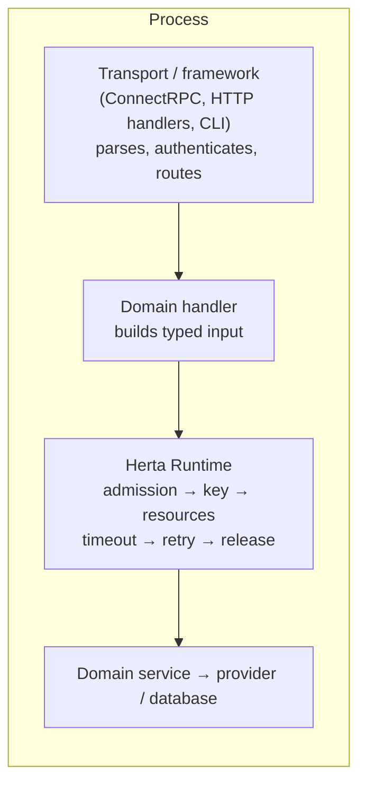
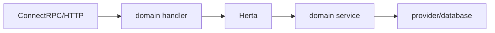

# Architecture

Where Herta sits, what belongs above and below it, and how a request flows
through a Herta-guarded service.

## Runtime boundary

Herta is not transport. It never sees HTTP, never parses requests, never owns
routing. It receives a typed input and a context from the domain handler and
returns a typed output or a classified error.

## What belongs above Herta

- Protocol handling: ConnectRPC/HTTP/gRPC servers, middleware, auth.
- Request parsing and validation of business shape.
- Building the typed `Operation` input from the request.
- Mapping Herta outcomes to transport responses (e.g. `Throttled` → 429).

## What belongs below Herta

- Domain services: the actual render, write, fetch, call.
- Providers and databases: the finite capacities budgets describe.
- Provider-specific error mapping into Herta outcomes (where the provider
  offers real signals; silence stays unclassified).

## Example integration

Concretely: an HTTP handler parses a render request, builds the render
operation input, and calls `render.Do(ctx, input)`. Herta admits it against
the `renderer` budget (waiting or rejecting per policy), enforces the
per-attempt timeout, classifies the outcome, retries only if the
Effect/Outcome contract allows, and returns. The handler maps the result to an
HTTP response. Nothing about HTTP lives in Herta; nothing about arbitration
lives in the handler.

## What Herta is not (architectural view)

| Concern | Owner | Not Herta |
|---|---|---|
| Transport, routing, auth | Framework layer | Herta never binds a port |
| Durability, queues, scheduling | Infrastructure | Herta holds no durable state |
| Cross-process limits | Provider / platform | Herta is per process |
| Business rules, validation | Domain | Herta owns policy, not logic |
| Retries of unknown safety | Nobody (rejected) | Herta refuses unsafe contracts |

If a concern needs the network, a daemon, or durable state, it belongs outside
the runtime. Herta's power comes from this restraint: one local contract,
enforced exactly.
