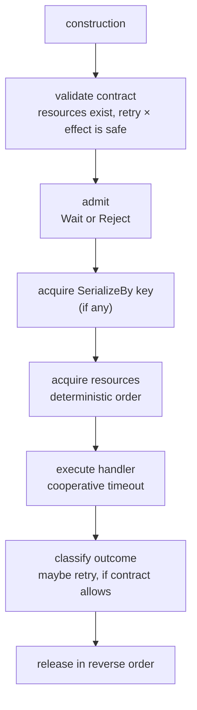

# Execution model

How one operation moves through the Herta runtime, in order.

## Operation lifecycle

Construction-time validation means an unsafe contract fails before serving —
not during a production incident.

## Admission

Each operation declares `Wait` or `Reject`:

- **Wait**: queue until capacity frees. The waiter holds no downstream
  resources while queued.
- **Reject**: fail immediately with a `Throttled` outcome when the budget is
  full. The caller decides what to do — back off, degrade, or drop.

Shutdown wakes all admission waiters with a shutdown error.

## Ordering: SerializeBy(key) before resources

When an operation declares both a key and resources, the runtime acquires the
key **first**:

1. Wait for (or acquire) the key.
2. Only then acquire resource budgets.
3. Execute.

This ordering is load-bearing: a same-key waiter must not hold scarce
downstream capacity while blocked behind another operation holding the same
key. Catalog replacements for brand A serialize while brand B proceeds
concurrently — and neither hoards the `db-write` budget while waiting.

## Deterministic multi-resource acquisition

An operation claiming multiple resources acquires them in a fixed global order
(sorting by resource name). This eliminates acquisition-order deadlocks between
heterogeneous operations that share overlapping budgets.

## Rollback

If acquisition of the second (or later) resource fails — timeout, cancellation,
or shutdown — already-acquired resources are released before the operation
fails. Partial acquisition never leaks, and never holds one budget while
abandoning another.

Partial-acquire rollback is covered by dedicated proof tests in the internal
reference implementation.

## Cooperative timeout

Timeouts are per-attempt `context.Context` deadlines passed to the handler:

- The runtime cancels the context; it does not kill the goroutine.
- Handlers that respect `ctx.Done()` stop promptly; handlers that ignore it
  run to completion and their result is discarded.
- Timeout expiry classifies as `Transient` (retryable, if the contract
  allows) — unless the operation is `NonIdempotent` and execution state is
  unknown, in which case it classifies as `Uncertain`.

Go has no safe goroutine termination. Herta does not pretend otherwise.

## Shutdown

`Shutdown()` performs three steps, in order:

1. **Stop admitting** new operations.
2. **Wake** operations waiting for admission, resources, or keys.
3. **Drain** operations already executing, then return.

Shutdown is part of the execution contract — callers can rely on it instead of
inventing their own drain logic per subsystem.
